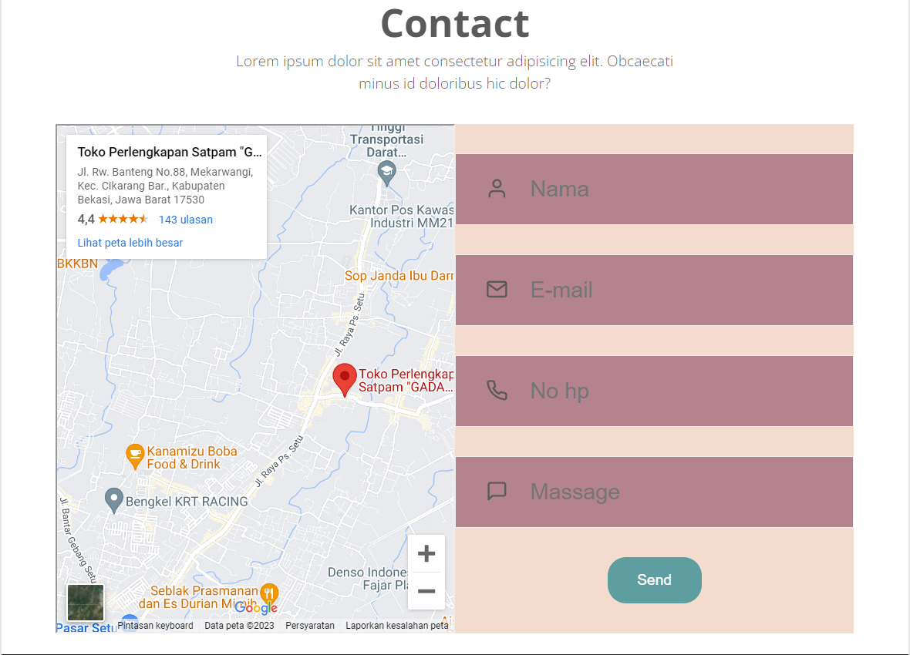

# Lab 4 Web

```
Nama    : Dipca Anugrah
NIM     : 312210666
Kelas   : TI.2.A.4
MATKUL  : Pemrograman Web 1
```

## **Daftar Isi**

**1. [Instruksi Praktikum](#instruksi-praktikum)**  
**2. [Langkah-langkah Praktikum](#langkah-langkah-praktikum)**  
**3. [Pertanyaan dan Tugas](#pertanyaan-dan-tugas)**

## **Instruksi Praktikum**

1. Persiapkan text editor misalnya VSCode.
2. Buat folder baru dengan nama Lab3Web
3. Ikuti langkah-langkah praktikum yang akan dijelaskan berikutnya.
4. Lakukan validasi dokumen html dengan mengakses http://validator.w3.org

## **Langkah-langkah Praktikum**

**Membuat Layout Sederhana**

**1. Membuat Navigasi**

**2. Membuat Hero Panel**

**3. Mengatur Layout Main dan Sidebar**

**4. Membuat Sidebar Widget**

**5. Mengatur Footer**

**6. Menambahkan Elemen lainnya pada Main Content**

**7. Menambahkan Content Artikel**

## **Pertanyaan dan Tugas**

1.  Tambahkan Layout untuk menu About
    => buat single layout yang berisi deskripsi, portfolio, dll

        ```html
        <!-- about section start -->
                <section id="about" class="about">
                    <h2>About</h2>

                    <div class="row">
                        <div class="about-img">
                            
                        </div>
                        <div class="content">
                            <h3>Kenapa, ada apa , mengapa ?</h3>
                            <p>"Greetings, I am Doni, an Information Technology student at Pelita Bangsa University. I have a
                                strong determination to become a reliable software engineer. In my educational journey, I deeply
                                reflected on the complex aspects of the world of technology and developed a deep passion for
                                overcoming existing challenges."</p>
                            <video src="videos/Activity Diagram Android.mp4" preload="metadata" controls></video>
                            <video src="videos/Basis Data Ruang Kelas.mp4" preload="metadata" controls></video>
                        </div>
                    </div>

                </section>
                <!-- about section end -->
        ```

    

2.  Tambahkan layout untuk menu Contact
    => yang berisi form isian: nama, email, message, dll
    ```html
    <!-- Contact section start -->
    <section class="contact" id="contact">
    <h2>Contact</h2>
    <p>Lorem ipsum dolor sit amet consectetur adipisicing elit. Obcaecati minus id doloribus hic dolor?</p>

                <div class="row">
                    <iframe
                        src="https://www.google.com/maps/embed?pb=!1m18!1m12!1m3!1d15862.477403841847!2d107.05481792893906!3d-6.313631871099128!2m3!1f0!2f0!3f0!3m2!1i1024!2i768!4f13.1!3m3!1m2!1s0x2e699048511923cd%3A0x55c07de5e2ace31d!2sToko%20Perlengkapan%20Satpam%20%22GADA%20CILALANG%22!5e0!3m2!1sid!2sid!4v1692315341556!5m2!1sid!2sid"
                        allowfullscreen="" loading="lazy" referrerpolicy="no-referrer-when-downgrade" class="map"></iframe>

                    <form action="">
                        <div class="input-group">
                            <label for="nama_user"><i data-feather="user"></i></label>
                            <input type="text" placeholder="Nama" id="nama_user">
                        </div>
                        <div class="input-group">
                            <label for="e-mail"><i data-feather="mail"></i></label>
                            <input type="text" placeholder="E-mail" id="e-mail">
                        </div>
                        <div class="input-group">
                            <label for="phone"><i data-feather="phone"></i></label>
                            <input type="text" placeholder="No hp" id="phone">
                        </div>
                        <div class="input-group">
                            <label for="message"><i data-feather="message-square"></i></label>
                            <input type="text" placeholder="Massage" id="phone">
                        </div>

                        <button class="btn" type="submit">Send</button>
                    </form>
                </div>
            </section>
            <!-- Contact section end -->
    ```
    